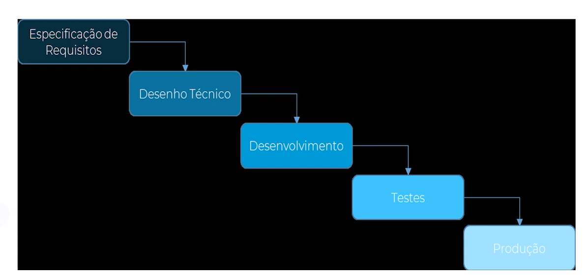
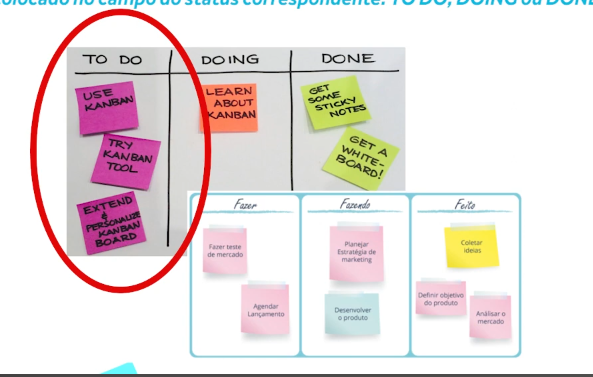

# Aulas

* [Aula 2 - Tecnicas de gerenciamento de projeto](#aula-2---tecnicas-de-gerenciamento-de-projeto)
* [Aula 3 - O Manifesto Ágil](#aula-3---o-manifesto-ágil)
* [Aula 4 - Os benefícios dos Métodos Ágeis](#aula-4---os-benefícios-dos-métodos-ágeis)
* [Aula 5 - Carecterísticas dos Métodos Ágeis](#aula-5---carecterísticas-dos-métodos-ágeis)
* [Aula 6 - Principais razões para adotar a Metodologia Ágil](#6---principais-razões-para-adotar-a-metodologia-ágil)
* [Aula 7 - Módelo Kanban](#aula-7---módelo-kanban)
* [Aula 8 - Características do Módelo Kanban](#aula-8---características-do-módelo-kanban)
* [Aula 9 - Kanban e a Melhoria Contínua dos Processos](#aula-9---kanban-e-a-melhoria-contínua-dos-processos)
* [Aula 10 - Contribuição do Kanban para a maturidade de equipe](#aula-10---contribuição-do-kanban-para-a-maturidade-de-equipe)
* [Aula 11 - Extremme Programming](#aula-11---extremme-programming)
* [Aula 12 - Valores Fundamentais da XP](#aula-12---valores-fundamentais-da-xp)
* [Aula 13 - Doze principais práticas XP](#aula-13---doze-principais-práticas-xp)

# Aula 2 - Tecnicas de gerenciamento de projeto

## Principais Técnicas de Gerenciamento de Projetos

* **Gráfico de Gantt** - Separa o projeto em varias etapas sequenciais.
* **PMBOK** - É uma das tecnicas mais usadas a decadas, conta com projetos longos e com muitas fazes a serem cumpridas.
* **Scrum** - Metodologi agil mais utilizada, trabalha com ciclos e fases
* **PRINCE2** - Flexivel com objetivo em prazo e custo controlado.
* **PERT** - Utilizada mais em fabricas e industrias, tecnica de previsão e avaliação do projeto
* **Extreme Programming** - Metodologia agil de TI buscando sempre excelencia do produto e do cliente 
* **Kanban** - Abordagem agil para gerenciamento do projeto avaliando tempo e orçamento, com entregas continuas. Funciona bem com o Scrum 
* **Método do Caminho Crítico (CPM)** - Usando junto ao PERT, controle de custos e prazos identificando as interdepencias das atividades com base no tempo utilizando representação visual
* **Diagrama de Ishikawa** - Conhecido como espinha de peixe. É uma ferramenta visual utilizada para gestão de controle de qualidade, antecipando os problemas
* **Lean** - Metodologia agil que busca enxugar as operações, evitando disperdicios e mantendo qualidade. Tenho alguns pilares
    * Rapidez na Entrega
    * Redução de desperdicio
    * Fortalecimento da equipe
    * Construção da qualidade
    * Adiamento de decisões
    * Amplificação do conhecimento
    * Aperfeiçoamento do processo como um todo

# Aula 3 - O Manifesto Ágil

> Durante o primeiro boom da internet, os modelos de gerenciamento de projetos eram engessados em etapas pré definidas. Tal utilização ia de encontro com a necessidade do mercado de softwares desenvolvidos mais rapidamente e com times interdisciplinares. Sendo assim o manifesto ágil foi criado.

* **Modelo cascata** - Modelo de gerenciamento de projeto onde todas as etapas eram bem definidas, sendo que para avançar a proxima a atual deverá estar concluida. Não preve alterações durante o desenvolvimento. Todos os requisitos definidos são mantidos e as necessidades adicionais não são levadas em considerações. É um modelo lento. Exige uma documentação bem pesada e robusta, tornando a alteração mais complexa. Focado muito no processo e não no produto.

    

* A metodologia agil surgiu na virada do seculo para resolver os problemas que o watterfall trazia. Sendo um modelo mais leve, comunicativo e aberto a mudanças. 

O manifesto agil gerou quatro fundamentos fundamentais.
    * Individuos e interações acima de processos e ferramentas.
    * Software funcionando acima de documentação abrangente.
    * Colaboração com o cliente acima de negociação de contratos.
    * Respostas as transformação ou mudanças, mais que seguir um plano estabelecido.

O manifesto agil estabeleceu doze principios
    
    1. Ter como prioridade a satisfação do cliente por meio de entregas de valor continuas e rapidas.
    
    2. Ser receptivo as alterações nos requisitos em qualquer fase do projeto. Alias, ambientes mutaveis são empregados em toda etada do projeto para entragar ao cliente vantagem competitiva.
    
    3. Realizar entregar frequentes (do produto ou serviço) no menor periodo de tempo possivel.
    
    4. Manter a colaboração das partes envolvidas em todo o projeto, diariamente
    
    5. Fornecer o ambiente, as ferramentas e o suporte necessarios aos individuos do projeto, alem de acreditar neles para realizar as atividades.
    
    6. Estimular a comunicação pessoal, para transmissão de informações, com especial atenção para reuniões presenciais, consideradas mais eficazes para o sucesso do projeto.
    
    7. Um produto final de trabalho corresponde a medida final do exito: no caso da tecnologia, consiste no softare funcionando.
    
    8. Os profissionais envolvidos no processo precisam manter um ritmo constante, de modo indefinido, pois fluxos ageis estimulam um desenvolvimento sustentavel
    
    9.  Manter anteção frequente a excelencia de design e tecnica eleva ou aprimora a agilidade
    
    10. Elimiar o maximo de esforçoes que não agregqam valor ao produto: simplicidade é fundamental.
    
    11. Equipes auto organizaveis atenderem aos requisitos do projeto
    
    12. Por meio de intervalos regulares, o time do projeto reflete sobre commo melhorar a sua eficiencia e eficacia para otimizar o seu comportamento

# Aula 4 - Os benefícios dos Métodos Ágeis

* Os metodos ageis surgiram como solução ao watterfall. Pressupondo pequenas entregas que são avaliadas pelo cliente ou stakeholder. No fim ja sai pronto pra uso.

* São metodologias adaptativas, ou seja iterativa e incremental.

Os maiores beneficios são:
    
    1. O payback do produto é maior devido ao prazo de desenvolvimento menor.
    
    2. Maior satisfação do cliente, devido a tudo estar funcional e poder ser mudado.
    
    3. Melhor visibilidade dos projetos: as informações são visiveis a todos, sendo totalmente transparente ao cliente.
    
    4. Maior produtividade.
    
    5. Equipes mais motivadas devido a interação e pequenos grupos de desenvolvimento.
    
    6. Melhor disciplina na engenharia e melhor qualidade interna
    
    7. Processo de desenvolvimento simplificado: os metodos ageis são mais simples para as equipes, visando todos saberem sobre o produto, oferecendo maior adaptação
    
    8. Redução de risco: O planejamento e o desenvolvimento sendo avaliado por alguem garante que o risco seja menor - codereview
    
    9. Maior balanceamento dos riscos: menores entregas mais velocidade e motivação
    
    10. Redução de custos: sempre visando o essencial, e as maiores prioridades, reduzindo o custo
    
    11. Abordagem alternativa aos metodos tradicionais de desenvolvimento, permite corrigir as desvantagens associadas a sua utilização - vide atualizações e melhorias

# Aula 5 - Carecterísticas dos Métodos Ágeis

* Os metodos ágeis defendem a ideia de que os softwares devem ser de qualidade, que o cliente a medida que recebe as entregas, ja deve receber o sistema pronto.

* A metodologia agil é mais apropriada a incertezas, devido a volatilidade do projeto ou do mercado.

As cinco áreas do mercado que mais utilizam metodologias ageis são:
    
    1. 27% em Tecnologia
    
    2. 17% em Serviços Financeiros
    
    3. 7% em Prestação de Serviços
    
    4. 7% no Setor Publico
    
    5. 6% na area de Seguros

Principais etapas para adoção das metologias ageis
    
    1. Valor: Identifique quais setores, produtos e fluxos de trabalho criam mais valor para o negócio. Valorando o produto.
    
    2. Estrutura: Crie fluxos de valor, de maneira a dar um sentido mais organizacional á tecnologia ou equipe.
    
    3. Roadmap de implementação: ao chegar as conclusões para todos esses pontos. é hora de definir o roadmap de implementação.

# Aula 6 - Principais razões para adotar a Metodologia Ágil

Principais melhorias da metodologia agil
    
    1. Acelera a entrega de seus produtos
    
    2. Aprima a habilidade de gerencias prioridades
    
    3. Melhora a produtividade

* Repasse de conhecimentos atraés dos multiplicadores.

* Maior integração entre a equipe.

* Aprendizado sobre como lidar com erros, maior facilidade de flexibilidade para correção de erros no produto.

Principais pontos a serem evitados na metologia agil
    
    1. Excesso de projetos paralelos ou acumulados nas equipes
    
    2. Excesso de reuniões
   
    3. Complexidade ignorada das ações

# Aula 7 - Módelo Kanban

* O molelo kanban é uma metodologia agil que trabalha com produções cartões que são marcados em colunas, onde cada coluna possui um status. Se baseia na ideia de que as atividades em andamento devem ser limitadas.

* Um novo item só pode ser iniciado quando o item em andamento for finalizado ou quando uma função automatica iniciar o mesmo.

* O kanban basicamente tem como principal objetivo tornar visivil para toda a equipe o trabalho em andamento, criando um sinal visual que o novo trabalho pode ou não ser iniciado.

* De origem japonesa sua tradução é algo como sinal ou cartão, ou registro visual.

* O mecanismo de sinalização o modelo tem por objetivo apresentar uma atividade de trabalho e processo, ou seja, o número de atividades ou cartões em circulação é equivalente a capacidade da equipe.

* Portanto ao inves dos membros que produzem o produto receberam a atividade conforme demanda, os requisitos são adicionados a uma lista de backlog e puxados pelos mebros da equipe quando ficam disponiveis

A implementação do modelo kanban se resume em três etapas:
    
    1. Visualizar os processos
   
    2. Limitar o trabalho em processo (WIP ~ Work in progress)
   
    3. Gerenciamento do lead-time, ou seja, tempo que a atividade leva para passar por todas as fases até sua entrega.

# Aula 8 - Características do Módelo Kanban

* Simples, barato e rapido.

* O numero de cartões representa a capacidade limite acordada em cada fase do sistema que são colocadas em circulação.

* Cada cartão funciona como mecanismo de sinalização e o sistema so permite uma nova tarefa quando um cartão estiver disponivel

Ganhos:

    * Melhoria da gestão de mudanças de prioridades

    * Maior visibilidade dos projetos

    * Maior simplificação do processo

    * Garantindo que todos os passos sejam seguidos do inicio ao fim

Rotina dos trabalhadores:
    
    * O colaborador chega ao trabalho e olha o quadro conferindo tudo que precisa fazer
    
    * Analisa as tarefas que foram finalizadas e as que ainda faltam concluir
    
    * Define o que precisa ser feito primeiro e o que precisa ser realocado
    
    * E ainda descobre que algumas coisas nem precisam ser feitas

* Divido em tres quadros

    

# Aula 9 - Kanban e a Melhoria Contínua dos Processos

O Kanban possui quatro principios fundamentais focados em melhoria continua de processos e pessoas
    
    1. Comece com o que você está fazendo agora
    
    2. Concorde em buscar mudanças evolucionarias
    
    3. Inicialmente, respeite os papeis, responsabilidades e cargos atuais
    
    4. Incentive atos de liderança em todos os niveis

* Uma das principais utilzações do kanban é a gestão à vista

Prepararativos para implementação do kanban
    
    1. Mapeamento dos processos
    
    2. Detalhamento das atividades e das entregas que serão monitoradas
    
    3. Priorização das atividades e definição dos recursos
    
    4. Montagem do Kanban
    
    5. Uso do kanban a plena força
    
    6. Melhoria continua

# Aula 10 - Contribuição do Kanban para a maturidade de equipe

* O kanban proprociona uma maior maturidade de equipe, atribuindo deveres e responsabilidades. Devido aos membros da equipe não estarem sobrecarregados, eles conseguem apoiar fortemente nos problemas encontrados.

* O kanban pode ser fisico ou digital.

Para se tornar um modelo kanban é necessario aplicar tres etapas

    1. Criar o painel de visualização
   
    2. Limitar os processos em WIP
   
    3. Gerenciar o lead-time: puxar uma nova tarefa SOMENTE quando o cartão está disponivel

Um quadro simples pode conter as seguintes etapas
    
    1. Analise
    
    2. Desenvolvimento
    
    3. Aceitação
    
    4. Implantação

# Aula 11 - Extremme Programming

A principal linha de raciocionio de criação dos metodos ageis foi publicado no chamado "Manifesto para o Desenvolvimento Ágil de Software". O qual valoriza quatro princípios:

    1. Individuos e interações acima de processos e ferramentas

    2. Software funcionando acima de documentação abrangente

    3. Colaboração com o cliente acima de negociação de contratos

    4. Responder as mudanças acima de seguir um plano.

Sendo assim processos ageis focam na entrega constante de funcionalidades, entregando produtos com valor agregado, pregando interação entre ambas as partes.

* A origem do XP remonta aos anos 90 quanto Kent Beck foi chamado para avaliar um projeto da Chrysler, que não foi para frente de 1993 a 1996. Após o sucesso no projeto da Chrysler, o XP foi considerado como uma nova estrela no meio do desenvolvimento de software. 

* A XP é uma metodologia de desenvolvimento de software voltada para pequenas e medias empresas, para sistemas que possuam requisitos vagos, com pouca precisão e muita mudança.

* O processo é composto por quatro atividades basicas: Planejamento, Projeto, Codificação e Teste, que são repetidas a cada Iteração após Iteração.

A XP é baseada em cinco valores fundamentais

    1. Comunicação entre o cliente e equipe de desenvolvimento. 
    
    2. A simplicidade faz a equipe implementar apenas o necessário.
    
    3. O feedback do cliente para com a equipe do desenvolvimento.
    
    4. A coragem trata da equipe acredita que, utilizando as praticas XP, será capaz de fazer o software evoluir com segurança e agilidade.
    
    5. O respeito com o time e o cliente é muito importante.

# Aula 12 - Valores Fundamentais da XP

Os quatro valores que servem como critérios que norteiam o XP
    
    1. Comunicação: Foca em construir um entendimento pessoa-a-pessoa do problema, com o minico de documentação formal, Programação em pares: Um desenvolve e um testa, depois é invertido para que o teste não fique viciado
    
    2. Simplicidade: Cada membro da equipe deve adotar o que é mais simples hoje, buscando um custo de manutenção e mudança baixa
    
    3. Feedback: Devido a programação em pares um testa e outra faz, dando feedback dos casos de uso e no fim o cliente testa e da o feedback

    4. Coragem: É necessário para que realmente se aplique a XP como ela deve ser aplicada. 

    5. Respeito

A XP também define um conjunto de principios que devem ser seguidos pelas equipes nas alternativas de solução de problemas durante o curso do projeto:

    1. Feedback rápido: a ideia de que os participantes do projeto devem ser sempre se comunicando para facilitar o aprendizado coletivo sobre o que está sendo desenvolvido e emitir alerta sobre dúvidas, riscos e problemas

    2. Assumir a simplicidade: Todo problema deve ser resolvido da forma mais simples possivel.

    3. Mudança incremental: muitas mudanças são realizadas todas de uma vez, não é bom. Os programadores têm sempre liberdade para fazer melhorias no código e mudanças de requisitos são incorporadas de forma incremental. 

    4. Abraçando mudanças (Embracing Changes): Facilita incluir alterações através do uso de vários princípios e práticas .

    5. Trabalho de qualidade: qualidade não é um critério opcional, mas sim obrigatório.

# Aula 13 - Doze principais práticas XP

 
    1. O jogo de planejamento ( histórias de usuários )
    
    2. Pequenos lançamentos
    
    3. Metáfora
    
    4. Design simples
    
    5. Teste
    
    6. Refatoração
    
    7. Programação de pares
    
    8. Propriedade coletiva
    
    9. Integração Contínua
    
    10. Semana de trabalho de 40 horas
    
    11. Cliente no local
    
    12. Codificação
